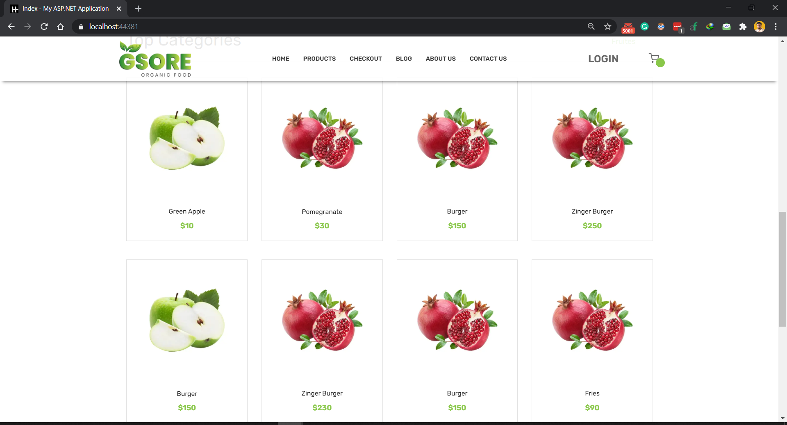
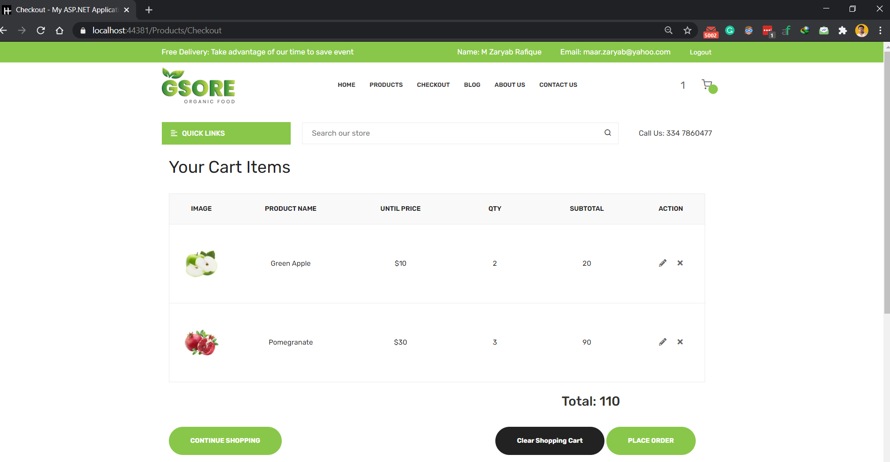
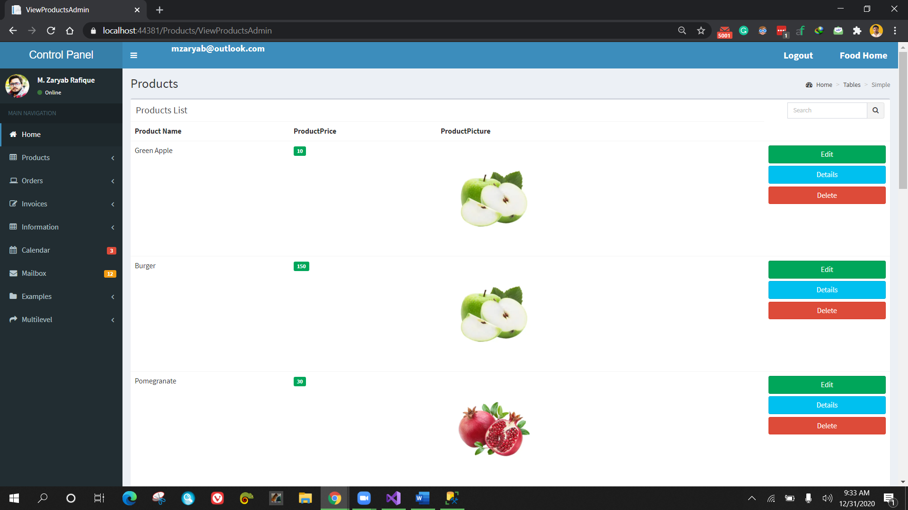
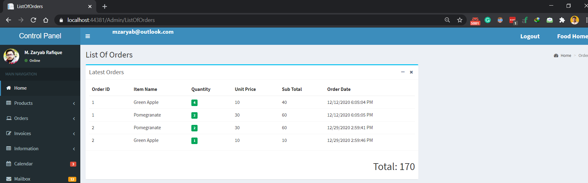

# FOOD ORDER AND DELIVERY WEBSITE ASP.NET MVC

### Project Detail
This is a web application of the Food Delivery project developed in Asp.net MVC. Food order and delivery website that helps the user to order food online and it helps the company owner to manage their order online, track their progress.

Functionalities:
- Authentication
- Admin Side
- Customer Side
- Optimized Search

Tools & Technologies:
- Language: C#
- Database: Microsoft SQL Server
- Frameworks: .Net, Entity Framework

<a href="https://www.youtube.com/watch?v=TkHSKbZm1RM">Project Video Demo</a>

### Customer Side

### Admin Side

